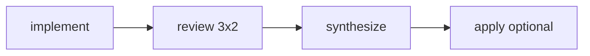

# CodePrism Architecture

CodePrism orchestrates three persona-driven agents (Melchior, Balthasar, Caspar) in a parallel multi-agent pipeline inside Cursor-capable environments.

## Components

| Layer | Path | Role |
|-------|------|------|
| CLI | `bin/codeprism` | Command dispatch, flag parsing |
| Config | `config/default.yaml`, repo `.codeprism.yaml` | Personas, backend, review, synthesis |
| Session | `.codeprism/sessions/<id>/` | `meta.json`, prompts, diffs, `SYNTHESIS.md` |
| Worktrees | `../.codeprism-worktrees/<session>/<agent>/` | Isolated implementations |
| Branches | `codeprism/<session>/<agent>` | Per-agent git branches |
| Agents | `lib/agent.sh` | cursor-cli, cursor-sdk, or manual |

## Phase flow

1. **Implement** — Three parallel worktrees; each agent gets persona + task template.
2. **Review** — Each agent reviews the other two diffs; labels anonymized (alpha/beta/gamma) when enabled.
3. **Synthesize** — Rapporteur (default Melchior) merges reviews into `SYNTHESIS.md`.
4. **Apply** — Cherry-pick or merge one agent branch into the target repo.

## Backend selection (`auto`)

1. `cursor agent` CLI if available
2. `@cursor/sdk` via `optional/sdk/run.mjs` if `CURSOR_API_KEY` is set
3. **Manual** — prompts written under the session directory

## Dependencies

- bash 4+, `git`, `python3` (JSON + light YAML)
- Optional: `tmux`, Cursor CLI, Node + `@cursor/sdk`
